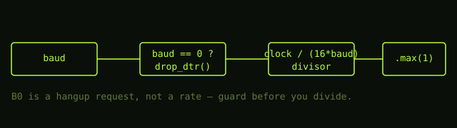

## The setup

POSIX says setting the input or output baud rate to `B0` on a terminal means
"hang up the line". It does **not** mean "configure the UART for zero bits per
second" — but a lot of driver code computes a divisor like this:

```c
uint32_t divisor = clock_hz / (16 * baud);
```

When `baud == 0`, that is a divide-by-zero. On some architectures it faults; on
others it silently produces garbage and the console wedges on the next write.

## The fix

Treat `B0` as a modem-control request, not a rate:

```rust
fn set_baud(ctx: &mut Termios, baud: u32) -> Result<(), Errno> {
    if baud == 0 {
        ctx.drop_dtr();      // hang up, per POSIX
        return Ok(());
    }
    let divisor = ctx.clock_hz / (16 * baud);
    ctx.write_divisor(divisor.max(1));
    Ok(())
}
```



Rolled out across 13 BSPs and drivers with a shared `termios` helper so the
guard lives in exactly one place.
