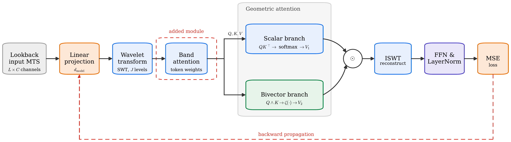
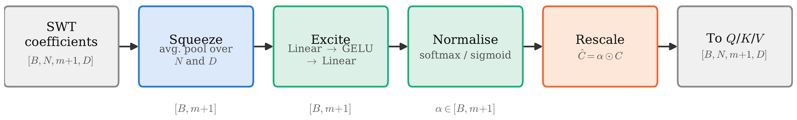
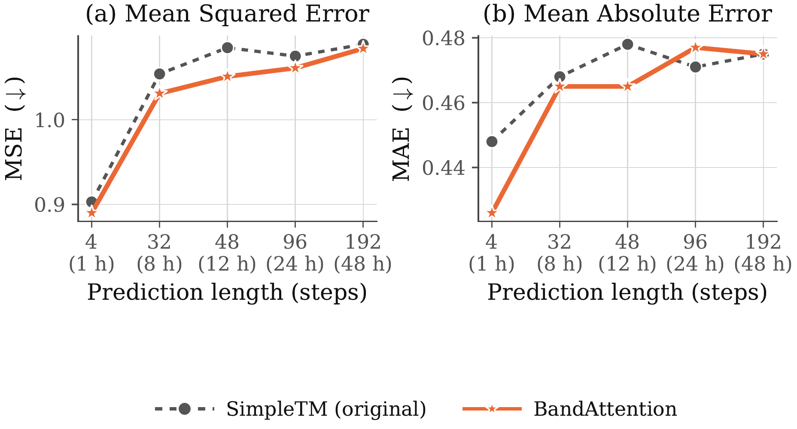

*This is a Simple overview of our BTech Thesis*

## Why household electricity is a hard forecasting problem

Forecasting electricity demand is easy at the level of an entire city, and hard at the level of one house. The reason is averaging. A city's demand is the sum of thousands of independent households, so the spikes and quirks of any one of them wash out and what's left is a smooth, predictable curve that mostly tracks the time of day.

A single house doesn't get that luxury. Its power draw is dominated by a handful of discrete events — a kettle switching on, a washing machine's spin cycle, an EV charger kicking in at midnight. There's a gentle daily rhythm underneath (people wake up, people sleep), but it's buried under a spiky, high-variance residual that looks almost like noise unless you know what caused it.

That's the crux of the problem this project is about: a model that only learns the smooth daily rhythm will miss every one of those spikes, and a model that chases the spikes too aggressively will overfit to noise. You need an architecture that can represent *both* the slow envelope and the fast transients, and — this is the part almost nobody does — decide **how much to trust each of those** depending on how far ahead it's trying to predict.

That last idea is what BandAttention adds. But to explain what it adds, we first need to walk through the model it sits inside.

<!-- pagebreak -->

## The landscape: how different models "look at" a time series

Every modern forecasting model answers the same underlying question differently: *before you apply attention, how should the input be represented?* That single design choice explains most of the differences between these architectures.

| Model | How it represents the input | Attention-stage cost |
|---|---|---|
| **Informer** | Sparsifies attention over raw time steps ("ProbSparse") and distills the sequence at each layer | O(L log L · d) |
| **Autoformer** | Splits the series into trend + seasonal parts, replaces attention with auto-correlation | O(L log L · d) |
| **FEDformer** | Does the trend/seasonal split in the *frequency* domain, over a sparse set of Fourier modes | O(L log L · d) |
| **PatchTST** | Groups adjacent time steps into patches, treats each channel independently | O(N_p² · d) |
| **iTransformer** | Inverts the usual layout — each *variable* becomes one token, attention runs across variables | O(N² · L · d) |
| **TimeMixer** | No attention at all — mixes information across multiple temporal scales with MLPs | O(L · d) |
| **SimpleTM** | Tokenises each channel with a wavelet transform, applies attention over the resulting time-frequency tokens | O(S · L′² · C) |

*(L = sequence length, d = model width, N = number of variables, N_p = number of patches, S = number of wavelet bands, L′ = token length per band, C = model dimension.)*

A quick tour of what each one is actually good at:

- **Informer**'s ProbSparse attention only bothers scoring the query/key pairs that are likely to matter, so it scales to very long sequences without paying the full quadratic cost of vanilla attention.
- **Autoformer** noticed that raw attention struggles to find periodicity, so it explicitly decomposes trend from seasonality and replaces the attention score with an auto-correlation computation — closer to how you'd find a repeating pattern by hand.
- **FEDformer** pushes the same trend/seasonal idea into the frequency domain. Its key insight, which matters a lot for what comes later in this post, is that **you shouldn't just keep the low frequencies and throw away the rest** — some of the sharpest, most important events in a series show up as high-frequency content, and discarding it loses real signal. It keeps a *sparse, fixed* random subset of Fourier modes as a compromise.
- **PatchTST** showed that just chunking the series into patches (like vision transformers do with image patches) and running channel-independent attention over them is a surprisingly strong, simple baseline.
- **iTransformer** flips the standard layout on its head: instead of one token per time step, it makes one token per *variable*, so attention learns cross-variable relationships directly.
- **TimeMixer** skips attention entirely and instead mixes information across several different temporal resolutions (downsampled versions of the same series) using plain MLPs.
- **SimpleTM** is the one this whole post is about. It takes yet another route: decompose each channel with a *wavelet* transform instead of a Fourier transform, and run a (slightly generalized) attention over the resulting bands. With just **one layer**, it matches or beats far bigger backbones on standard forecasting benchmarks, at a fraction of the parameter count.

The wavelet choice is what makes SimpleTM interesting for household load specifically — because a wavelet decomposition naturally separates "the daily envelope" from "the appliance-scale bursts" into different bands. That's exactly the two things we said we needed to represent, back in the intro.

<!-- pagebreak -->

## Inside SimpleTM: following the tensor shapes

Let's actually trace what happens to the input as it flows through SimpleTM, layer by layer, with shapes.

**1. Lookback window.** You start with a window of `L` time steps across `N` variables — shape `[L, N]` (or `[B, L, N]` with a batch dimension). For the household-load setup here, `L = 96` (a 96-hour lookback at hourly resolution), and all channels are fed in, but only the load channel is scored at the output (this is called the *multivariate-to-univariate* setting).

**2. Linear projection.** A linear layer lifts each time step from `N` raw channels to `d_model` hidden channels. Shape becomes `[L, d_model]`. In the configuration used for the experiments here, `d_model = 256`.

**3. Stationary Wavelet Transform (SWT).** This is the heart of SimpleTM's design. A normal (discrete) wavelet transform downsamples at every level, which shifts the phase alignment between levels and makes it awkward to use for forecasting, where the exact timing of an event matters. The *stationary* wavelet transform instead keeps every level at full resolution and dilates the filter instead of shrinking the signal. Concretely, starting from `a₀ = x` and using a low-pass filter `h₀` and high-pass filter `h₁`:

```
dℓ = h₁ *₂^(ℓ-1) a_{ℓ-1}      (detail band at level ℓ)
aℓ = h₀ *₂^(ℓ-1) a_{ℓ-1}      (smoothed approximation at level ℓ)
```

Run this for `m` levels and you're left with `S = m + 1` bands, ordered from smoothest to finest:

```
{ a_m, d_m, d_{m-1}, ..., d_1 }  ∈  ℝ^(S × D)
```

`a_m` is the smooth, low-frequency approximation — think of it as the daily envelope. `d_1` is the finest detail band — appliance switching, metering noise, the spiky stuff. In the experiments, `m = 3` detail levels (a Haar/`db1` wavelet basis), giving `S = 4` bands total. Shape is now `[S, L′, D]` where `L′` is the token length per band (here `L′ = 256`, since the SWT doesn't downsample).

**4. Query/Key/Value projections.** Each band is treated as its own stream of tokens, and standard linear layers produce `Q, K, V ∈ ℝ^(L′ × C)` per band.

**5. Geometric-product attention.** This is SimpleTM's other headline idea. Instead of the usual dot-product attention, it replaces the inner product between two tokens `α` and `β` with the full *geometric product* from geometric algebra: `αβ = α·β + α∧β`. The first term (`α·β`, the dot product) is the familiar "how similar are these two tokens" scalar. The second term (`α∧β`, the wedge product) captures the *oriented area* the two tokens span — information a plain dot product throws away entirely. Written as an attention block:

```
GPA(Q, K, V) = softmax(dot(Q,K) / √C) · V + ζ(wedge(Q,K) / √C) · V
                └────── scalar branch ──────┘   └── bivector branch ──┘
```

Both branches run per band, independently, and are fused elementwise (`ζ(·)` just reduces the bivector part down to a scalar — its magnitude). This runs once per band, so all `S` bands get attended over separately, each at cost `O(L′² · C)` — giving the total `O(S · L′² · C)` from the table above.

**6. Inverse SWT (ISWT).** The attended bands are transformed back into the time domain using the paired reconstruction filters, undoing step 3.

**7. Feed-forward + LayerNorm**, then the **MSE loss** against the true future window, trained end to end with backpropagation through the whole pipeline. One more detail worth mentioning: because household load is non-stationary (its mean and variance drift with season, day of week, occupancy), the whole window is normalized by its own statistics before any of this and denormalized again at the very end — a trick called RevIN.

<div class="prose-diagram">

</div>

## SimpleTM's real strength — and its blind spot

SimpleTM's strength is exactly the wavelet tokenization we just walked through: it hands the model separate, phase-aligned streams for "slow trend" and "fast detail," instead of forcing everything through one undifferentiated representation. That's a genuinely good match for a signal that *is* a slow envelope plus fast bursts, which is precisely what household load looks like.

But look again at step 5. Every band — `a_m` down to `d_1` — enters attention with **exactly the same weight**, for every input window, and for every forecast horizon you ask it for. SimpleTM never revisits that assumption. And there's good reason to think it shouldn't hold:

- If you're forecasting **one hour ahead**, the fine detail bands are genuinely useful — an appliance that's running right now is very likely to still be running in an hour.
- If you're forecasting **forty-eight hours ahead**, those same fine bands are close to useless. By then, appliance-level detail has no persistence, and the only band still carrying real signal is the smooth daily envelope.

So the "correct" emphasis across bands isn't a constant — it's a function of the forecast horizon (and even of the specific window: a quiet overnight stretch and a window with a big appliance transient in it don't carry information in the same places). A model that treats every band identically is leaving this on the table.

This is, funnily enough, almost exactly the gap that **FEDformer** identified earlier, in the frequency domain rather than the wavelet domain: *some frequency content matters more than others, and a model that discards it — or treats it all the same — throws away real signal.* FEDformer's answer was to keep a fixed, sparse set of Fourier modes. SimpleTM's wavelet bands are a much better basis for this exact household-load problem, but it never actually asks FEDformer's question of its own bands. It just keeps all of them, weighted equally, always.

That's the opening BandAttention is built to close: give SimpleTM an explicit, *learned*, *input-dependent* answer to "how much should each band matter, right now, for this window, at this horizon" — instead of a silent assumption that the answer is always "equally."

<!-- pagebreak -->

## BandAttention: making band importance something the model learns

The fix is deliberately small. BandAttention is a single lightweight module inserted between the SWT and the Q/K/V projections. It doesn't touch the backbone, doesn't change any tensor shape, and if you strip it out, you get back exactly the original SimpleTM forward pass. It works in four steps, borrowed from squeeze-and-excitation networks (a technique originally built for reweighting *channels* in a CNN feature map — here it's repurposed to reweight *frequency bands* instead).

<div class="prose-diagram">

</div>

Let `C ∈ ℝ^(B×N×S×D)` be the SWT coefficient tensor for one of the Q, K, or V streams.

**Step 1 — Squeeze.** Each band gets collapsed down to a single number per sample, by averaging over the variable and feature axes:

```
g_i = (1 / N·D) · Σ_n Σ_d  C[b, n, i, d]        g ∈ ℝ^(B×S)
```

Now instead of a big tensor, you have one short descriptor vector per sample — one number summarizing "how much is going on" in each band.

**Step 2 — Excite.** That descriptor vector is passed, *as a whole*, through a small two-layer network:

```
z = W₂ · GELU(W₁·g + b₁) + b₂
```

This is the important bit: because all `S` band descriptors go through the network *together*, the model can compare bands against each other — "band 1 looks busy relative to band 3" — rather than judging each band in isolation. That's what actually lets it express a preference.

**Step 3 — Normalise.** The raw scores `z` get turned into a proper weight vector via softmax (the default, and what's used for every result in this post):

```
α_i = exp(z_i) / Σ_j exp(z_j)
```

**Step 4 — Rescale.** The weights broadcast back out and multiply the *original* coefficient tensor, band by band:

```
Ĉ[b, n, i, d] = α[b, i] · C[b, n, i, d]
```

Those rescaled coefficients are what actually get read out into Q, K and V. Because α is applied to all three, the effect compounds inside attention itself — the score between two tokens ends up scaled by the *product* of their bands' weights, and the value stream is scaled by a third. In effect, the module doesn't just turn a band's amplitude up or down: it controls how strongly that band gets to interact with everything else, for this specific input.

**What this costs.** Two small weight matrices and two bias vectors — about **40 extra parameters per layer** in this configuration (`S = 4` bands, hidden width `h = 4`). For reference, that's smaller than a single row of any projection matrix already in the backbone. In complexity terms, the band-level computation is `O(S²·d)` against the backbone's `O(S·L′²·C)` — for the exact sizes used here, that's **512 versus roughly 67 million**, a ratio of about **131,000 to 1**, or a **0.00076%** relative overhead. In plain terms: this module is asymptotically and practically free next to the cost of the attention it's sitting next to.

One thing worth being explicit about, since it's easy to read too much into a paper's "Future Work" section: this describes the module **exactly as it was built and evaluated** — signed average pooling in the squeeze step, softmax normalization in step 3, applied independently to each of Q, K and V. There are some refinements we identified afterwards (pooling *energy* instead of a signed average, rescaling the softmax output, sharing one weight vector across Q/K/V) that we believe would make the gain even larger — but those are proposed next steps, not something that was already built. Every number in the next section is from the module as described above.

<!-- pagebreak -->

## Does it actually help? The numbers

All of this was evaluated on real household electricity consumption records, sampled every 15 minutes, interpolated where readings were missing, and aggregated to an hourly resolution. The data was split chronologically — 70% train, 10% validation, 20% test — with a fixed 96-hour lookback, and five forecast horizons: 1 hour, 8 hours, 12 hours, 24 hours, and 48 hours ahead.

<div class="prose-diagram">

</div>

Averaged across all five horizons, adding BandAttention to SimpleTM took:

- **Average MSE from 1.041 → 1.023** — a **1.73%** improvement
- **Average MAE from 0.468 → 0.461** — a **1.50%** improvement

But the average hides the more interesting story, which is *where* the gain shows up. At the **1-hour horizon**, MAE dropped from 0.448 to 0.426 — a **4.9% reduction**, the single largest improvement anywhere in the results. The gap narrows through the middle horizons and is essentially gone by 48 hours (the two curves land within 0.005 of each other). That's exactly the pattern the design predicts: an adaptive band weighting can only help for as long as the fine detail bands still carry usable signal, and for hourly household load, that window runs out somewhere past the 24-hour mark.

For context against other published models on the same setup: **Autoformer** is competitive at the shortest horizon but degrades as the horizon grows, and loses to SimpleTM+BandAttention on both metrics at every length tested. **FEDformer** trails by a wide margin throughout — consistent with its own design assumption (a sparse, fixed set of *global* Fourier modes is a poor fit for a signal that's a smooth envelope plus a genuinely non-sparse burst process). Two other baselines, TimeMixer and iTransformer, produced flat, horizon-independent errors in this setup — a sign they were emitting near-constant predictions rather than genuinely forecasting, so they're excluded from the comparison as artefacts rather than real results.

## Beyond MSE and MAE

MSE and MAE are the headline numbers, but the companion B.Tech thesis this work is drawn from also tracks eight further metrics — RMSE, MAPE, MSPE, SMAPE, R², explained variance, median absolute error, and maximum error — across the same five horizons, mainly to check that the MSE/MAE story isn't an artefact of those two metrics specifically. It mostly isn't:

- **RMSE** is just √MSE, so it tells exactly the same story by construction: about **0.87% lower on average** (≈1.011 vs ≈1.020), widening to roughly **0.7% lower at the 1-hour horizon**.
- **Median absolute error (MedAE)** — which ignores outliers entirely and reports the *typical* error — is markedly lower for BandAttention at short horizons (roughly **14% lower at 1 hour**) and converges with the unmodified branch by the longest horizon. This matters because it rules out the possibility that the MSE/MAE gain is just a few lucky, well-predicted spikes dragging the average down — the *typical* prediction genuinely got better too.
- **R² and explained variance** both jump noticeably at the 1-hour horizon roughly **21% improvement** for the unmodified branch — several times more of the target's variance explained, then decay toward the same small value both models reach by 48 hours. Same horizon-dependent story as MSE, just on a variance-explained scale instead of an error scale.
- **Maximum error** is the one metric that *doesn't* fully agree — BandAttention's worst single point-wise miss tracks close to the unmodified branch rather than clearly improving on it. A model can get better on average while leaving its single worst mistake basically unchanged, and that's what happens here. It's a useful reminder that "better on average" and "safer in the worst case" are different claims.
- **MAPE, MSPE and SMAPE** (the percentage-based metrics) show the same short-horizon advantage for BandAttention, but the thesis flags them as the least trustworthy of the ten: household load drops close to zero overnight, and dividing by a near-zero true value inflates percentage errors in a way that has little to do with model quality. They're included for completeness, not as the headline evidence.

The short version: nine times out of ten metrics, the story from MSE and MAE holds up — a real, short-horizon-concentrated improvement that fades by the longest horizon. The one exception (maximum error) is a legitimate, different claim that BandAttention was never designed to address.

Put simply: for about 40 extra parameters per layer and a complexity overhead too small to matter, letting the model *learn* which wavelet bands to trust — instead of assuming they're all equally useful, forever — buys a real, horizon-dependent improvement, concentrated exactly where the underlying physics says it should be: the short-term forecasts where fine-grained appliance behavior is still predictable.

---

*If you want the full formal treatment — proofs, the complete related-work discussion, and the exact experimental configuration — that's all in the paper this post is based on. This was the plain-language tour of what the module does and why it works.*
